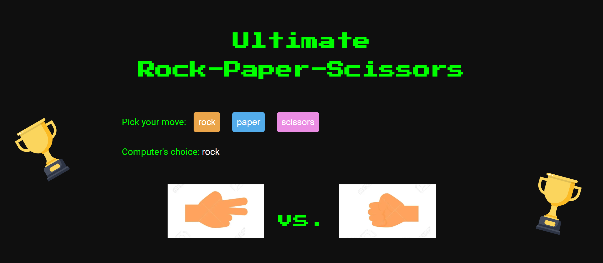
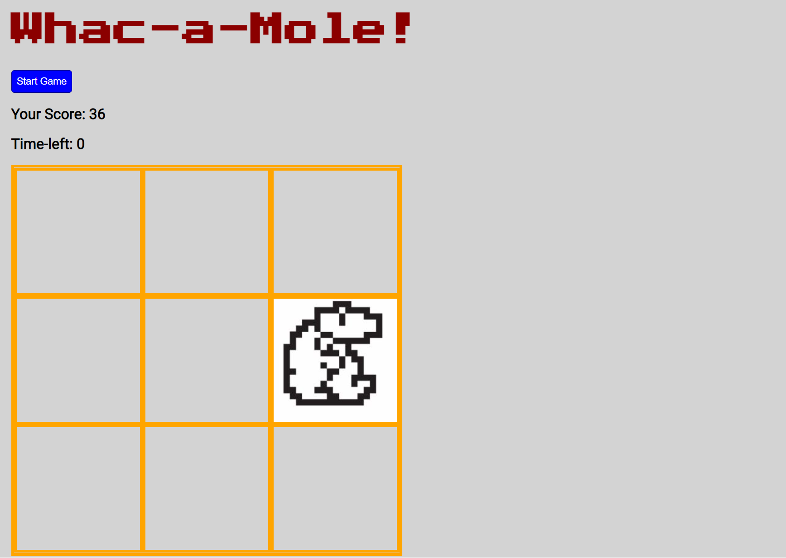

# js-game-projects

**Projects by freecodeCamp in [this](https://www.youtube.com/watch?v=ec8vSKJuZTk&t=8887s) video**
  

1 ~~ Rock Paper Scissors Game - [click here](https://htmlpreview.github.io/?https://github.com/mivmiyv/js-game-projects/blob/main/rock-paper-scissors/index.html) to preview

 

  

2 ~~ Memory Cards - [click here](https://htmlpreview.github.io/?https://github.com/mivmiyv/js-game-projects/blob/main/memory%20game/index.html) to preview

 

  

3 ~~ Whac-a-mole! - [click here](https://htmlpreview.github.io/?https://github.com/mivmiyv/js-game-projects/blob/main/whac-a-mole/index.html) to preview

 

  
